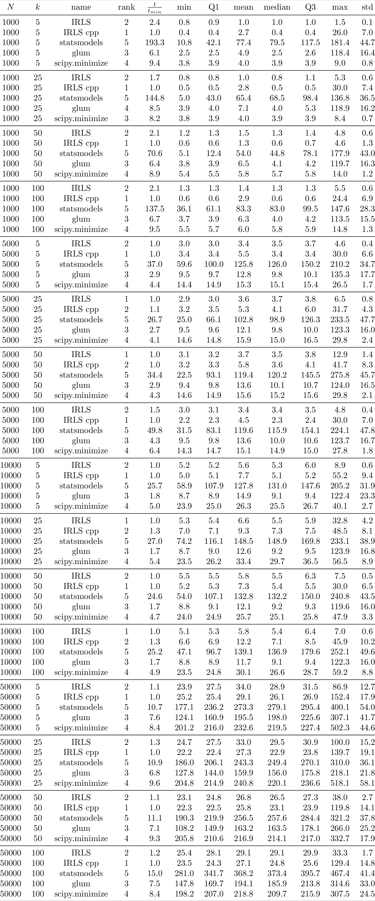
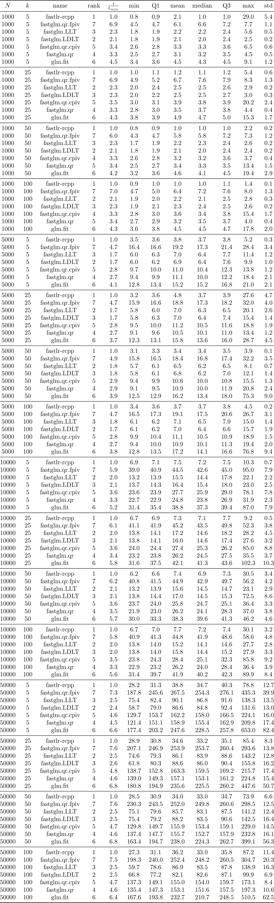

# Tables of benchmarking results

- Constructed [here](../scripts/table.py)
- $\frac{t}{t_{min}}$ is the median run time divided by the lowest median run time for
  given $(N, k)$
- `rank` is a ranking of the median run time for given $(N, k)$ (lower is
  better)

## Python

## R

